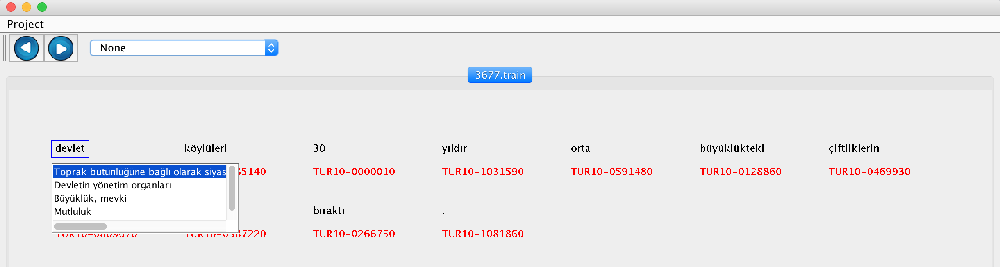
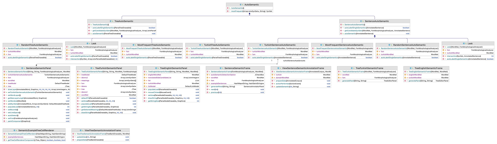

# Word Sense Disambiguation

## Task Definition

The task of choosing the correct sense for a word is called word sense disambiguation (WSD). WSD algorithms take an input word *w* in its context with a fixed set of potential word senses Sw of that input word and produce an output chosen from Sw. In the isolated WSD task, one usually uses the set of senses from a dictionary or theasurus like WordNet. 

In the literature, there are actually two variants of the generic WSD task. In the lexical sample task, a small selected set of target words is chosen, along with a set of senses for each target word. For each target word *w*, a number of corpus sentences (context sentences) are manually labeled with the correct sense of *w*. In all-words task, systems are given entire sentences and a lexicon with the set of senses for each word in each sentence. Annotators are then asked to disambiguate every word in the text.

In all-words WSD, a classifier is trained to label the words in the text with their set of potential word senses. After giving the sense labels to the words in our training data, the next step is to select a group of features to discriminate different senses for each input word.

The following Table shows an example for the word 'yüz', which can refer to the number '100', to the verb 'swim' or to the noun 'face'.

|Sense|Definition|
|---|---|
|yüz1 (hundred)|The number coming after ninety nine|
|yüz2 (swim)|move or float in water|
|yüz3 (face)|face, visage, countenance|

## Data Annotation

### Preparation

1. Collect a set of sentences to annotate. 
2. Each sentence in the collection must be named as xxxx.yyyyy in increasing order. For example, the first sentence to be annotated will be 0001.train, the second 0002.train, etc.
3. Put the sentences in the same folder such as *Turkish-Phrase*.
4. Build the project and put the generated sentence-semantics.jar file into another folder such as *Program*.
5. Put *Turkish-Phrase* and *Program* folders into a parent folder.

### Annotation

1. Open sentence-semantics.jar file.
2. Wait until the data load message is displayed.
3. Click Open button in the Project menu.

4. Choose a file for annotation from the folder *Turkish-Phrase*.  

5. For each word in the sentence, click the word, and choose correct sense for that word.

6. Click one of the next buttons to go to other files.

## Classification DataSet Generation

After annotating sentences, you can use [DataGenerator](https://github.com/starlangsoftware/DataGenerator) package to generate classification dataset for the Word Sense Disambiguation task.

## Generation of ML Models

After generating the classification dataset as above, one can use the [Classification](https://github.com/starlangsoftware/Classification) package to generate machine learning models for the Word Sense Disambiguation task.

Class Diagram
============

For Developers
============

You can also see [Python](https://github.com/starlangsoftware/WordSenseDisambiguation-Py), [Cython](https://github.com/starlangsoftware/WordSenseDisambiguation-Cy), [C++](https://github.com/starlangsoftware/WordSenseDisambiguation-CPP), [Swift](https://github.com/starlangsoftware/WordSenseDisambiguation-Swift), [Js](https://github.com/starlangsoftware/WordSenseDisambiguation-Js), or [C#](https://github.com/starlangsoftware/WordSenseDisambiguation-CS) repository.

## Requirements

* [Java Development Kit 8 or higher](#java), Open JDK or Oracle JDK
* [Maven](#maven)
* [Git](#git)

### Java 

To check if you have a compatible version of Java installed, use the following command:

    java -version
    
If you don't have a compatible version, you can download either [Oracle JDK](https://www.oracle.com/technetwork/java/javase/downloads/jdk8-downloads-2133151.html) or [OpenJDK](https://openjdk.java.net/install/)    

### Maven
To check if you have Maven installed, use the following command:

    mvn --version
    
To install Maven, you can follow the instructions [here](https://maven.apache.org/install.html).      

### Git

Install the [latest version of Git](https://git-scm.com/book/en/v2/Getting-Started-Installing-Git).

## Download Code

In order to work on code, create a fork from GitHub page. 
Use Git for cloning the code to your local or below line for Ubuntu:

	git clone <your-fork-git-link>

A directory called WordSenseDisambiguation will be created. Or you can use below link for exploring the code:

	git clone https://github.com/olcaytaner/WordSenseDisambiguation.git

## Open project with IntelliJ IDEA

Steps for opening the cloned project:

* Start IDE
* Select **File | Open** from main menu
* Choose `WordSenseDisambiguation/pom.xml` file
* Select open as project option
* Couple of seconds, dependencies with Maven will be downloaded. 

## Compile

**From IDE**

After being done with the downloading and Maven indexing, select **Build Project** option from **Build** menu. After compilation process, user can run WordSenseDisambiguation.

**From Console**

Go to `WordSenseDisambiguation` directory and compile with 

     mvn compile 

## Generating jar files

**From IDE**

Use `package` of 'Lifecycle' from maven window on the right and from `WordSenseDisambiguation` root module.

**From Console**

Use below line to generate jar file:

     mvn install

## Maven Usage

        <dependency>
            <groupId>io.github.starlangsoftware</groupId>
            <artifactId>WordSenseDisambiguation</artifactId>
            <version>1.0.1</version>
        </dependency>

Detailed Description
============

## ParseTree

In order to sense annotate a parse tree, one can use autoSemantic method of the TurkishTreeAutoSemantic class.

	ParseTreeDrawable parseTree = ...
	WordNet wordNet = new WordNet();
	FsmMorphologicalAnalyzer fsm = new FsmMorphologicalAnalyzer();
	TurkishTreeAutoSemantic turkishAutoSemantic = new TurkishTreeAutoSemantic(wordnet, fsm);
	turkishAutoSemantic.autoSemantic();

## Sentence

In order to sense annotate a parse tree, one can use autoSemantic method of the TurkishSentenceAutoSemantic class.

	AnnotatedSentence sentence = ...
	WordNet wordNet = new WordNet();
	FsmMorphologicalAnalyzer fsm = new FsmMorphologicalAnalyzer();
	TurkishSentenceAutoSemantic turkishAutoSemantic = new TurkishSentenceAutoSemantic(wordnet, fsm);
	turkishAutoSemantic.autoSemantic();

# Cite

	@INPROCEEDINGS{8093442,
  	author={O. {Açıkgöz} and A. T. {Gürkan} and B. {Ertopçu} and O. {Topsakal} and B. {Özenç} and A. B. {Kanburoğlu} and İ. {Çam} and B. {Avar} and G. {Ercan} 		and O. T. {Yıldız}},
  	booktitle={2017 International Conference on Computer Science and Engineering (UBMK)}, 
  	title={All-words word sense disambiguation for Turkish}, 
  	year={2017},
  	volume={},
  	number={},
  	pages={490-495},
  	doi={10.1109/UBMK.2017.8093442}}
